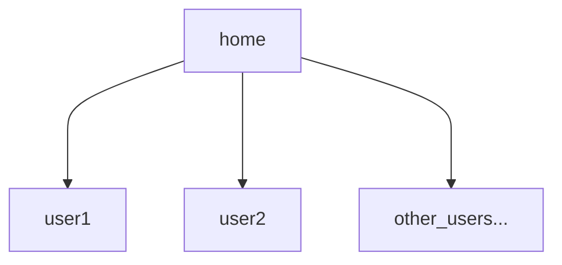

# Linux文件系统入门

文章：**@CoraBlack**

学习Linux的文件系统对你了解Linux的帮助无疑是巨大的。也许你听过，Linux是一个类Unix操作系统，在Unix操作系统中有一个贯穿整个操作系统设计的理念：**一切皆文件**。在后续你对Linux的认识不断加深，对这种设计理念的感知和感悟会越来越深。在本篇中，我们会了解到：```Linux的基本文件结构```，```一些用于描述目录的具有特殊意义的符号```

那么，我们从文件树的结构开始吧♥️

## 根目录 ```/```

> - **注意⚠️**：根目录的内容与系统运行密切相关，不要为了好奇而乱修改根目录下的没有用户权限的文件，这样做会威胁你的系统运行安全！！！！！！！！！！！！
>
> - 如果你对你在非用户目录下的操作没有把握，请事先备份你需要操作的文件
>
> - 本期中只会将绝大多数Linux系统中的泛用文件树结构，其他特有的文件目录不做涉及

在学习之前，我们先认识一点：Linux的**文件结构**是**树状**的🌲，那么这颗巨大的树的开始，就是**根目录**，也就是```/```  
我们可以尝试一下使用```ls```命令打印一下根目录的表层内容🖨

```bash
# 打印根目录
ls /
```

你大抵会看见输出这些内容👀

```bash
# @符号指的是软链接，可以使用 ls -l 查看链接目标，在本篇不做详细解释
bin@  boot/  dev/  etc/  home/  lib@  lib64@  mnt/  null  opt/  proc/  root/  run/  sbin@  srv/  sys/  tmp/  usr/  var/
```

现在，我们一个一个来了解一下。

### ```usr```（Unix system resource）目录

在这个文件夹中，存放着与系统运行密切相关的文件和可执行程序，包括但不限于**Linux内核源码**、**系统应用程序**、**库文件**、**头文件**……等等等等。其实我们现在看见的这么多目录，有几个关键且重要的目录就是软链接了```usr```目录下的内容，那么我们也来看看```usr```里面有什么内容吧😯

```bash
# 打印usr目录下的表层文件内容
ls /usr
```

你会看见👀

```bash
bin/  include/  lib/  lib32/  lib64@  local/  sbin@  share/  src/
```

是不是你看见了一些很相似的内容。对！Linux的根目录下的链接文件可以说是全部来自```usr```目录。那么我们从第一个开始吧！

### ```bin```（Binaries）目录

从文件名的全程来看，不难理解到这个目录下存放着**二进制的可执行程序文件**，我们使用的命令和应用都存放在这里。不信？你可以搜索一下我们常用的```ls```命令

```bash
# 查找bin目录下含有ls的结果
ls /bin | grep “ls”
```

输出的内容很多，但是你肯定可以看到一个```ls```的内容，是不是证实了以上的内容，```bin```目录下存放着我们的**应用程序**和**命令程序**

### ```sbin```（Superuser Binaries）目录

```sbin```和```bin```目录仅有一字之差，但也有不小的差别  
首先来说，s前缀指代了**superuser(超级用户)**，说明```sbin```目录下的可执行文件是为超级用户服务的（也就是root用户）

> 事实上，有些Linux中```bin```和```sbin```链接的都是```/usr/bin```目录，其实只是在执行时的权限问题
> 可以使用```ls -l```命令查看root和一般用户的命令权限差异

### ```boot```目录

这个目录是一个非常重要的目录，它通常挂载的是Linux所在硬盘的EFI分区。里面存放着Linux内核和内核引导文件，以及一些镜像文件，```boot```目录里的文件异常则可能导致我们无法正常引导Linux系统，对```boot```目录进行操作前若对操作的安全性未知，一定要备份！

### ```dev```（Device）目录

这个目录也是Linux的一个很重要的目录，而且我们以后也会借助这个目录下绑定的设备信息对设备进行操作。对的，这个目录下就是我们电脑上的硬件内容，不过，特殊的是，它们被抽象成一个个文件。这使得我们可以像操作文件一样去操作计算机的硬件。对的，这也是类Unix系统中一切皆文件设计理念的实现之一。  
这是一件很酷的事情！因为它大大提高了硬件的抽象等级和降低了硬件沟通的难度。这一点，我们会在学习硬盘挂载的内容中体验到，这种一切皆文件的设计思想的魅力！

### ```media```目录

当你插入一个U盘，或者使用光驱进行某些操作时，你就会用到这个目录了。当你接入一些移动存储设备、CD驱动器时，他们会被挂载在```media```目录下。

### ```mnt```（mount）目录

字面上，它的作用是用于挂载设备的（通常是硬盘设备），它设计用于作为挂载硬盘的默认路径。当然，你也可以不喜欢这么做，挂载到任何一个你喜欢的目录

### ```etc```（Etcetera）目录

这个也是一个非常重要的目录（根目录下的几个表层目录就没不重要的）。你可以理解为，这是一个系统环境的配置和应用程序配置的超级config文件夹。但是，它不仅仅是一个配置文件存储的文件夹，还有很多内容，比如**环境变量**、**输入法配置等等**……

### ```home```目录

这个目录是默认的用户目录，其文件结构大概为：



默认来说，你在创建一个用户时（非特殊指定用户目录），都会在```home```目录下创建一个与用户名相同的文件夹，作为该用户的**用户目录**

### ```sys```（System）目录

你知道它里面有运行时的内核文件就行了。

### ```srv```（Service）目录

正如其名，里面存放的是系统服务文件，用于服务进程提取所需数据使用。

### ```tmp```（Temporary）目录

临时目录，存放着一些系统产生的临时文件（平时也别动啊！）

### ```var```（Variable）目录

这个目录中存放着在不断扩充着的东西，我们习惯将那些经常被修改的目录放在这个目录下。包括各种日志文件。

### ```proc```（Processes）目录

```proc```是一种伪文件系统（也即虚拟文件系统），存储的是当前内核运行状态的一系列特殊文件，这个目录是一个虚拟的目录，它是系统内存的映射，我们可以通过直接访问这个目录来获取系统信息。

我们可以尝试打印我们的CPU信息

```bash
# 打印CPU信息
cat /proc/cpuinfo
```

## Linux中用于描述目录的特殊符号

如果你在某个目录中使用```ls -l```命令，你会看见在列出的文件信息中的最顶端，有```.```和```..```两个列出项。为什么他们会存在我们目录中？我使用```ls -a```命令也无法看见它们呢啊！接下来，我们来讲解一下浙西特殊符号

### ```.``` 当前目录

对的，就是那么简单。```.```符号的意义就是用户当前所处的目录。emmm,没什么好说的。

### ```..``` 上级目录

顾名思义，```..```符号表示当前目录的上一级目录。举个例子，如果你正在```/home/user/Downloads```目录中，那么你的上一级目录是```/home/user```

### ```-``` 上次目录

这个特殊符号会在```cd```命令中比较常用，使用```cd -```可以返回刚刚所在的目录中去

```bash
# Example
# 假设当前为 /home/user/Pictures 目录，我需要查看文档的内容
cd ../Documents

# 处理完我的工作后，我认为我需要继续回到图片目录下进行工作
cd - 

# 这个实例非常简单，当你跨了两个相对路径很远的目录频繁操作时，就会体现这个符号的意义
```

### ```～``` 当前用户所属的用户目录

```bash
# Example
# 使用cd命令返回用户目录
cd ～
# 此时，我们便回到了 /home/user（没有特殊指代用户目录位置） 目录下了
```

恭喜你🎉，完成了Linux文件结构的一个简单认识。多加实践，才能更灵活地使用他们。  
加油，小企鹅🐧
